# Random Quote Generator (separate files)

<!-- NOVA:ULTIMATE:START -->
<div align="center">


### Random Quote Generator



**Goal:** Build resilient asynchronous flows with HTTP requests, loading states, validation, and error handling.

</div>

## 🧭 NOVA Folder Guide

| Metric | Value |
|---|---:|
| Readiness | **80%** |
| Files | 5 |
| Source files | 3 |
| Test files | 0 |
| Text lines | 337 |

### ▶️ Main paths

- `Week4AdvAsynchronousJavaScript/Day3HTTPAndFormMethodGETAndPOST/Exercises/RandomQuoteGenerator/index.html`
- `Week4AdvAsynchronousJavaScript/Day3HTTPAndFormMethodGETAndPOST/Exercises/RandomQuoteGenerator/js/app.js`

### 🚀 Run

```bash
python -m http.server 8000
node Week4AdvAsynchronousJavaScript/Day3HTTPAndFormMethodGETAndPOST/Exercises/RandomQuoteGenerator/js/app.js
```

### 🟢 What is already strong

- ✅ README documentation is generated and repeatable.
- ✅ Contains 3 source file(s) across practical exercises or projects.
- ✅ No Python syntax error was detected in this folder tree.
- ✅ A likely runnable entry point was detected.

### 🟠 What to improve next

- ⚠️ No local unit test is present yet; repository-wide syntax checks still cover the sources.

### 🧪 Validation

```bash
python tools/nova_quality_gate.py --repo . --strict
python -m unittest discover -s tests/python -p "test_*.py" -v
node tools/run_node_tests.mjs .
```

> The readiness value is a transparent repository heuristic, not a course grade and not proof that every interactive or external-API exercise was executed.

<sub>Managed by NOVA Ultimate v2.0.0 · 2026-07-15T06:22:49+03:00</sub>
<!-- NOVA:ULTIMATE:END -->

Learn and practice:
- Conditionals and the ternary operator
- Loops and array methods
- Arrow functions
- Objects, DOM manipulation, and events

## What you build
A small app that:
- Generates a random quote (never the same twice in a row)
- Lets you add new quotes (automatic `id`, starts at 0)
- Likes the current quote
- Shows character and word counts for the current quote
- Filters quotes by author with Previous/Next navigation

## Files
```
random-quote-generator/
├─ index.html
├─ css/
│  └─ styles.css
└─ js/
   └─ app.js
```

## Run
Open `index.html` in your browser.

## UI
- 🔁 **Generate Quote**: shows a random quote (not the same as the immediately previous one).
- 👍 **Like**: increments the like count for the shown quote.
- 🔡 **Chars (with spaces / no spaces)** and 🧮 **Word count**: display metrics for the current quote.
- ➕ **Add a quote**: submit text and author to append to the list (id auto-increments).
- 🔎 **Filter by author**: type a name (case-insensitive contains), then use ⏮️/⏭️ to navigate results. **Clear** resets the view.

## Notes
- Emojis are used for clarity; no hearts.
- IDs are assigned as `maxId + 1` for robustness.
- Random selection ignores any active filter; filtered results are navigated with Previous/Next.
- All logic uses plain JavaScript and DOM APIs.
