# Daily Challenge: True or False

<!-- NOVA:ULTIMATE:START -->
<div align="center">


### True Or False



**Goal:** Build resilient asynchronous flows with HTTP requests, loading states, validation, and error handling.

</div>

## 🧭 NOVA Folder Guide

| Metric | Value |
|---|---:|
| Readiness | **80%** |
| Files | 5 |
| Source files | 3 |
| Test files | 0 |
| Text lines | 230 |

### ▶️ Main paths

- `Week4AdvAsynchronousJavaScript/Day3HTTPAndFormMethodGETAndPOST/DailyChallenge/TrueOrFalse/app.js`

### 🚀 Run

```bash
node Week4AdvAsynchronousJavaScript/Day3HTTPAndFormMethodGETAndPOST/DailyChallenge/TrueOrFalse/app.js
```

### 🟢 What is already strong

- ✅ README documentation is generated and repeatable.
- ✅ Contains 3 source file(s) across practical exercises or projects.
- ✅ No Python syntax error was detected in this folder tree.
- ✅ A likely runnable entry point was detected.

### 🟠 What to improve next

- ⚠️ No local unit test is present yet; repository-wide syntax checks still cover the sources.

### 🧪 Validation

```bash
python tools/nova_quality_gate.py --repo . --strict
python -m unittest discover -s tests/python -p "test_*.py" -v
node tools/run_node_tests.mjs .
```

> The readiness value is a transparent repository heuristic, not a course grade and not proof that every interactive or external-API exercise was executed.

<sub>Managed by NOVA Ultimate v2.0.0 · 2026-07-15T06:22:49+03:00</sub>
<!-- NOVA:ULTIMATE:END -->

A tiny JS function that returns `true` only if **all** parameters are truthy.

## Function
```js
function allTruthy(...values) {
  for (const v of values) {
    if (!v) return false;
  }
  return true;
}
```

> FYI: A short version is `const allTruthy = (...v) => v.every(Boolean)`.

## Examples
- `allTruthy(true, true, true) ➞ true`
- `allTruthy(true, false, true) ➞ false`
- `allTruthy(5, 4, 3, 2, 1, 0) ➞ false`

## Files
- `index.html` — tiny demo page
- `style.css` — minimal styling
- `app.js` — the function + examples + a basic input parser for your own tests

## How to run
- Just open `index.html` in your browser (double-click). No build step needed.
