# Daily Challenges — Promises & Morse

<!-- NOVA:ULTIMATE:START -->
<div align="center">


### Play With Words



**Goal:** Build resilient asynchronous flows with HTTP requests, loading states, validation, and error handling.

</div>

## 🧭 NOVA Folder Guide

| Metric | Value |
|---|---:|
| Readiness | **80%** |
| Files | 4 |
| Source files | 2 |
| Test files | 0 |
| Text lines | 265 |

### ▶️ Main paths

- `Week4AdvAsynchronousJavaScript/Day4AsynchronousJavaScript/DailyChallenge/PlayWithWords/daily_promises_morse.js`
- `Week4AdvAsynchronousJavaScript/Day4AsynchronousJavaScript/DailyChallenge/PlayWithWords/index_daily_challenges.html`

### 🚀 Run

```bash
node Week4AdvAsynchronousJavaScript/Day4AsynchronousJavaScript/DailyChallenge/PlayWithWords/daily_promises_morse.js
python -m http.server 8000
```

### 🟢 What is already strong

- ✅ README documentation is generated and repeatable.
- ✅ Contains 2 source file(s) across practical exercises or projects.
- ✅ No Python syntax error was detected in this folder tree.
- ✅ A likely runnable entry point was detected.

### 🟠 What to improve next

- ⚠️ No local unit test is present yet; repository-wide syntax checks still cover the sources.

### 🧪 Validation

```bash
python tools/nova_quality_gate.py --repo . --strict
python -m unittest discover -s tests/python -p "test_*.py" -v
node tools/run_node_tests.mjs .
```

> The readiness value is a transparent repository heuristic, not a course grade and not proof that every interactive or external-API exercise was executed.

<sub>Managed by NOVA Ultimate v2.0.0 · 2026-07-15T06:22:49+03:00</sub>
<!-- NOVA:ULTIMATE:END -->

Short, commented solutions in vanilla JavaScript. Includes a minimal UI and the exact chains requested.

## Files
- `index_daily_challenges.html` — Minimal UI to try both challenges.
- `daily_promises_morse.js` — All exercises implemented (short & simple).
- `README` — This file.

## 1) makeAllCaps & sortWords
```js
const makeAllCaps = (arr) => new Promise((resolve, reject) => {
  const allStrings = Array.isArray(arr) && arr.every(x => typeof x === "string");
  if (!allStrings) return reject("All items must be strings.");
  resolve(arr.map(w => w.toUpperCase()));
});

const sortWords = (arr) => new Promise((resolve, reject) => {
  if (!Array.isArray(arr)) return reject("Expected an array.");
  if (arr.length > 4) resolve([...arr].sort());
  else reject("Array must have more than 4 items.");
});
```

### Tests included (UI buttons)
- `[1]` `makeAllCaps([1, "pear", "banana"])` → **reject**
- `[2]` `makeAllCaps(["apple","pear","banana"]) → sortWords(...)` → **reject**
- `[3]` `makeAllCaps(["apple","pear","banana","melon","kiwi"]) → sortWords(...)` → **resolve & sort**

## 2) Morse Translator (Promises chain)
- `toJs()` → parses the given JSON string to a JS object (reject if empty/invalid).
- `toMorse(morseJS)` → requests input (from the text box, or `prompt` if empty), validates characters and returns an array of codes (reject on unsupported char).
- `joinWords(array)` → joins with line breaks and writes to the DOM.

### Example (input “Hello”)
```
....
.
.-..
.-..
---
```

## How to run
### Browser
1. Open `index_daily_challenges.html`.
2. Use the three buttons for Challenge 1.
3. For Morse: type text or leave it empty to use the prompt, then click **Translate**.
4. Check the Console for logs if needed.

### Node (optional)
You can import the functions from `daily_promises_morse.js` if you want to test in Node.

## Notes
- Code is intentionally concise and commented in English.
- Morse mapping also supports a space (`" "`) → `/` so you can separate words visually.
