# Exercises XP — Fetch API & Async/Await (separate files)

> Current evidence (2026-08-24): source and safe configuration pattern present; live Giphy/SWAPI behavior, browser accessibility, explanation, and mastery are unverified.

<!-- NOVA:ULTIMATE:START -->
<div align="center">


### Exercises XP



**Goal:** Build resilient asynchronous flows with HTTP requests, loading states, validation, and error handling.

</div>

## 🧭 NOVA Folder Guide

| Metric | Value |
|---|---:|
| Readiness | **80%** |
| Files | 7 |
| Source files | 4 |
| Test files | 0 |
| Text lines | 206 |

### ▶️ Main paths

- `Week4AdvAsynchronousJavaScript/Day5FetchAndAsyncAwait/Exercises/ExercisesXP/index.html`
- `Week4AdvAsynchronousJavaScript/Day5FetchAndAsyncAwait/Exercises/ExercisesXP/js/app.js`

### 🚀 Run

```powershell
Copy-Item .\Week4AdvAsynchronousJavaScript\Day5FetchAndAsyncAwait\Exercises\ExercisesXP\js\config.example.js .\Week4AdvAsynchronousJavaScript\Day5FetchAndAsyncAwait\Exercises\ExercisesXP\js\config.js
python -m http.server 8000
```

### 🟢 What is already strong

- ✅ README documentation is generated and repeatable.
- ✅ Contains 4 source file(s) across practical exercises or projects.
- ✅ No Python syntax error was detected in this folder tree.
- ✅ A likely runnable entry point was detected.

### 🟠 What to improve next

- ⚠️ No local unit test is present yet; repository-wide syntax checks still cover the sources.

### 🧪 Validation

```bash
python tools/nova_quality_gate.py --repo . --strict
python -m unittest discover -s tests/python -p "test_*.py" -v
node tools/run_node_tests.mjs .
```

> The readiness value is a transparent repository heuristic, not a course grade and not proof that every interactive or external-API exercise was executed.

<sub>Managed by NOVA Ultimate v2.0.0 · 2026-07-15T06:22:49+03:00</sub>
<!-- NOVA:ULTIMATE:END -->

Learn and practice:
- Fetch API
- Async/Await
- Proper status checks and error handling

## Files
```
exercises-xp-fetch-async/
├─ index.html         # Buttons to run each exercise + output panel
├─ css/
│  └─ styles.css
└─ js/
   ├─ app.js          # Implementations for Exercises 1–4
   └─ config.example.js # Safe template; local config.js stays ignored
```

## Usage
1. Copy `js/config.example.js` to `js/config.js` and replace the placeholder with a restricted personal development key. Root `.gitignore` keeps `config.js` untracked.
2. From the repository root, run `python -m http.server 8000` and open the exercise through that local server.
3. Open DevTools (Console).
4. Click each button to run the respective exercise:
   - Exercise 1: Giphy search for “hilarious” — logs full JSON to console and a summary to the panel.
   - Exercise 2: Giphy search for “sun” with `limit=10&offset=2` — logs full JSON and shows titles.
   - Exercise 3: SWAPI starship (async/await only) — logs `objectStarWars.result` to console and the name to the panel.
   - Exercise 4: Shows `calling` immediately, then after ~2 seconds `resolved`.

## Notes
- The earlier hard-coded Giphy credential was removed from the current tree. Treat any key previously committed to Git history as exposed and rotate/revoke it if it belongs to you.
- Browser API keys remain visible to site visitors; use a restricted development key here, never a production secret.
- All requests check `response.ok` and throw for non-2xx status codes, caught with `try/catch`.
- Panel shows a compact summary; the Console displays the full response objects.
- Emojis are used for clarity; no hearts.
