# Currency Converter

<!-- NOVA:ULTIMATE:START -->
<div align="center">


### Currency Converter



**Goal:** Use TypeScript types, interfaces, classes, unions, and guards to make domain logic safer.

</div>

## 🧭 NOVA Folder Guide

| Metric | Value |
|---|---:|
| Readiness | **80%** |
| Files | 4 |
| Source files | 2 |
| Test files | 0 |
| Text lines | 852 |

### ▶️ Main paths

- `Week5MiniProjectAndTypeScript/Day1MiniProject/DailyChallenge/CurrencyConverter/index.html`

### 🚀 Run

```bash
python -m http.server 8000
```

### 🟢 What is already strong

- ✅ README documentation is generated and repeatable.
- ✅ Contains 2 source file(s) across practical exercises or projects.
- ✅ No Python syntax error was detected in this folder tree.
- ✅ A likely runnable entry point was detected.

### 🟠 What to improve next

- ⚠️ No local unit test is present yet; repository-wide syntax checks still cover the sources.

### 🧪 Validation

```bash
python tools/nova_quality_gate.py --repo . --strict
python -m unittest discover -s tests/python -p "test_*.py" -v
node tools/run_node_tests.mjs .
```

> The readiness value is a transparent repository heuristic, not a course grade and not proof that every interactive or external-API exercise was executed.

<sub>Managed by NOVA Ultimate v2.0.0 · 2026-07-15T06:22:49+03:00</sub>
<!-- NOVA:ULTIMATE:END -->

A modern currency converter web application that uses the ExchangeRate API to provide real-time currency conversion rates.

## Description

This application allows users to convert between different currencies using live exchange rates. It features a clean, modern interface with dropdown selectors for currencies, an amount input field, and a convenient switch button to swap currencies instantly.

## Features

- 💱 Real-time currency conversion using ExchangeRate API
- 🌍 Support for 160+ currencies worldwide
- 🔄 Switch button to swap "From" and "To" currencies instantly
- 📊 Display of conversion result and exchange rate
- ⏳ Loading indicator during API calls
- ⚠️ Error handling with user-friendly messages
- 📱 Responsive design for all devices
- ⌨️ Enter key support for quick conversion
- 🎨 Modern gradient UI with smooth animations

## Technologies Used

- HTML5
- CSS3 (Animations, Flexbox, Gradients)
- JavaScript (ES6+)
- Fetch API
- Async/Await
- ExchangeRate API: https://www.exchangerate-api.com/

## Project Structure

```
DailyChallange/
├── index.html      # HTML structure with form elements
├── styles.css      # Modern styling with animations
├── script.js       # Logic with async/await and API integration
└── README.md       # This file
```

## Setup Instructions

### 1. Get Your API Key

1. Visit [ExchangeRate-API](https://www.exchangerate-api.com/)
2. Sign up for a free account
3. Copy your API key from the dashboard

### 2. Configure the Application

Open `script.js` and replace `YOUR_API_KEY_HERE` with your actual API key:

```javascript
const API_KEY = 'your_actual_api_key_here';
```

### 3. Run the Application

Simply open `index.html` in your web browser. No server required!

## How to Use

1. **Select Source Currency**: Choose the currency you want to convert from in the "From" dropdown
2. **Select Target Currency**: Choose the currency you want to convert to in the "To" dropdown
3. **Enter Amount**: Input the amount you want to convert
4. **Convert**: Click the "Convert" button or press Enter
5. **View Result**: See the converted amount and exchange rate
6. **Switch Currencies** (Bonus): Click the switch button (⇅) to swap the currencies

## API Integration

### Endpoints Used

1. **Supported Codes Endpoint**
   - URL: `https://v6.exchangerate-api.com/v6/{API_KEY}/codes`
   - Purpose: Fetch all supported currency codes and names
   - Used to populate the dropdown selectors

2. **Pair Conversion Endpoint**
   - URL: `https://v6.exchangerate-api.com/v6/{API_KEY}/pair/{FROM}/{TO}/{AMOUNT}`
   - Purpose: Get conversion rate and converted amount
   - Used when user clicks "Convert" button

### API Response Structure

**Codes Endpoint Response:**
```json
{
  "result": "success",
  "supported_codes": [
    ["USD", "United States Dollar"],
    ["EUR", "Euro"],
    ...
  ]
}
```

**Pair Conversion Response:**
```json
{
  "result": "success",
  "base_code": "USD",
  "target_code": "EUR",
  "conversion_rate": 0.85,
  "conversion_result": 85.00
}
```

## Features Implemented

### Core Features

- ✅ Fetch all supported currencies on page load
- ✅ Populate dropdown menus with currency options
- ✅ Convert between any two currencies
- ✅ Display converted amount
- ✅ Show exchange rate (1 FROM = X TO)
- ✅ Loading indicator during API calls
- ✅ Error handling and user feedback

### Bonus Features

- ✅ Switch button to swap currencies
- ✅ Automatic conversion after switching
- ✅ Enter key support
- ✅ Form validation
- ✅ Smooth animations
- ✅ Modern gradient design

## Code Highlights

### Async/Await Pattern

All API calls use async/await for clean, readable asynchronous code:

```javascript
async function loadSupportedCurrencies() {
    const response = await fetch(`${BASE_URL}/${API_KEY}/codes`);
    const data = await response.json();
    populateCurrencySelects(data.supported_codes);
}
```

### Switch Functionality

The bonus feature allows instant currency swapping:

```javascript
function switchCurrencies() {
    const fromValue = fromCurrencySelect.value;
    const toValue = toCurrencySelect.value;
    
    fromCurrencySelect.value = toValue;
    toCurrencySelect.value = fromValue;
    
    convertCurrency();
}
```

### Amount in URL

The API supports passing the amount directly in the URL:

```javascript
const response = await fetch(
    `${BASE_URL}/${API_KEY}/pair/${fromCurrency}/${toCurrency}/${amount}`
);
```

## Error Handling

The application handles various error scenarios:
- Invalid API key
- Network errors
- Invalid amount input
- Missing currency selection
- API response errors

## Design Features

- **Modern Card Layout**: Glassmorphism effect with backdrop blur
- **Gradient Background**: Purple gradient with subtle pattern overlay
- **Smooth Animations**: Fade-in, slide-in, and rotation effects
- **Interactive Elements**: Hover effects on buttons and inputs
- **Loading Spinner**: Animated circular spinner during API calls
- **Color-coded Results**: Gradient background for conversion results
- **SVG Icons**: Custom switch arrow icon

## Responsive Design

The converter adapts to different screen sizes:
- Desktop: Full-width card with optimal spacing
- Tablet: Adjusted padding and font sizes
- Mobile: Compact layout with touch-friendly controls

## Browser Compatibility

Works on all modern browsers supporting:
- ES6+ JavaScript features
- Fetch API
- CSS Grid and Flexbox
- CSS animations and transforms

## Validation

Input validation includes:
- Amount must be a positive number
- Both currencies must be selected
- Real-time error messages for invalid inputs

## Default Values

- **From Currency**: USD (United States Dollar)
- **To Currency**: ILS (Israeli New Sheqel)
- **Amount**: 1

## API Limits

Free tier includes:
- 1,500 requests per month
- All currency pairs supported
- No credit card required

For more requests, consider upgrading your plan at ExchangeRate-API.com

## Future Enhancements

Possible improvements:
- Historical exchange rate charts
- Favorite currency pairs
- Recent conversions history
- Offline mode with cached rates
- Multiple currency comparison
- Currency trend indicators
- Auto-refresh rates

## Troubleshooting

**Problem**: Currencies not loading
- **Solution**: Check your API key is correctly set in `script.js`

**Problem**: Conversion fails
- **Solution**: Ensure you have active internet connection and valid API key

**Problem**: "Error loading currencies" message
- **Solution**: Verify API key and check browser console for errors

## Author

Project developed as part of the Daily Challenge for Day 1, Week 5 of the Fullstack 2026 bootcamp.

## License

This project is open source and available for educational purposes.

## Credits

- Exchange rates provided by [ExchangeRate-API](https://www.exchangerate-api.com/)
- Icons: Custom SVG icons
