# Week5 Mini Project And Type Script

<!-- NOVA:ULTIMATE:START -->
<div align="center">


### Week5 Mini Project And Type Script



**Goal:** Use TypeScript types, interfaces, classes, unions, and guards to make domain logic safer.

</div>

## 🧭 NOVA Folder Guide

| Metric | Value |
|---|---:|
| Readiness | **80%** |
| Files | 48 |
| Source files | 11 |
| Test files | 0 |
| Text lines | 3,781 |

### ▶️ Main paths

- `Week5MiniProjectAndTypeScript/Day1MiniProject/DailyChallenge/CurrencyConverter/index.html`
- `Week5MiniProjectAndTypeScript/Day1MiniProject/Exercises/Pokedex/index.html`
- `Week5MiniProjectAndTypeScript/Day1MiniProject/StarWarsWebApp/index.html`
- `Week5MiniProjectAndTypeScript/Day2IntroductionToTypeScriptAndKeyConcepts/DailyChallenge/UnionTypeValidator/package.json`

### 🚀 Run

```bash
python -m http.server 8000
python -m http.server 8000
python -m http.server 8000
```

### 🟢 What is already strong

- ✅ README documentation is generated and repeatable.
- ✅ Contains 11 source file(s) across practical exercises or projects.
- ✅ No Python syntax error was detected in this folder tree.
- ✅ A likely runnable entry point was detected.

### 🟠 What to improve next

- ⚠️ No local unit test is present yet; repository-wide syntax checks still cover the sources.

### 🧪 Validation

```bash
python tools/nova_quality_gate.py --repo . --strict
python -m unittest discover -s tests/python -p "test_*.py" -v
node tools/run_node_tests.mjs .
```

> The readiness value is a transparent repository heuristic, not a course grade and not proof that every interactive or external-API exercise was executed.

<sub>Managed by NOVA Ultimate v2.0.0 · 2026-07-15T06:22:48+03:00</sub>
<!-- NOVA:ULTIMATE:END -->
