# Pokédex App

<!-- NOVA:ULTIMATE:START -->
<div align="center">


### Pokedex



**Goal:** Use TypeScript types, interfaces, classes, unions, and guards to make domain logic safer.

</div>

## 🧭 NOVA Folder Guide

| Metric | Value |
|---|---:|
| Readiness | **80%** |
| Files | 3 |
| Source files | 1 |
| Test files | 0 |
| Text lines | 931 |

### ▶️ Main paths

- `Week5MiniProjectAndTypeScript/Day1MiniProject/Exercises/Pokedex/index.html`

### 🚀 Run

```bash
python -m http.server 8000
```

### 🟢 What is already strong

- ✅ README documentation is generated and repeatable.
- ✅ Contains 1 source file(s) across practical exercises or projects.
- ✅ No Python syntax error was detected in this folder tree.
- ✅ A likely runnable entry point was detected.

### 🟠 What to improve next

- ⚠️ No local unit test is present yet; repository-wide syntax checks still cover the sources.

### 🧪 Validation

```bash
python tools/nova_quality_gate.py --repo . --strict
python -m unittest discover -s tests/python -p "test_*.py" -v
node tools/run_node_tests.mjs .
```

> The readiness value is a transparent repository heuristic, not a course grade and not proof that every interactive or external-API exercise was executed.

<sub>Managed by NOVA Ultimate v2.0.0 · 2026-07-15T06:22:49+03:00</sub>
<!-- NOVA:ULTIMATE:END -->

A Pokémon Pokédex web application that uses the PokeAPI to fetch and display Pokémon information in an interactive Pokedex device interface.

## Description

This application recreates the classic Pokédex experience, allowing users to browse through Pokémon by getting random ones or navigating sequentially through the Pokédex. The interface mimics a real Pokedex device with a screen, information display, and interactive buttons.

## Features

- 🎮 Interactive Pokedex device design
- 🎲 Random Pokémon generation (1010 Pokémon available)
- ⬅️➡️ Navigation with previous/next buttons
- 🖼️ High-quality official Pokémon artwork
- 📊 Display of Pokémon stats: ID, height, weight, and types
- ⏳ Loading animation while fetching data
- ⚠️ Error handling with user-friendly messages
- 📱 Responsive design for different screen sizes
- 🔄 Wrap-around navigation (goes from last to first and vice versa)

## Technologies Used

- HTML5
- CSS3 (with animations and gradients)
- JavaScript (ES6+)
- Fetch API
- Async/Await
- PokeAPI: https://pokeapi.co/

## Project Structure

```
Pokedex/
├── index.html      # HTML structure with Pokedex design
├── styles.css      # Styles for Pokedex device and animations
├── script.js       # Logic with async/await and API calls
└── README.md       # This file
```

## Implemented Features

### HTML (index.html)

- Pokémon logo at the top
- Instructions section for user guidance
- Pokedex device structure with:
  - Top section with decorative dots and screen area
  - Screen for displaying Pokémon images
  - Bottom section with controls and info display
  - D-pad (directional pad) for navigation
  - Info display panel (tan-colored screen)
  - Green button for random Pokémon

### CSS (styles.css)

- Authentic Pokedex design with red device body
- Gradient purple background
- Screen with dark border and blue gradient background
- D-pad styling with 4-directional buttons
- Info display with retro tan color
- Green button with realistic gradient and shine effect
- Loading spinner animation
- Type badges with colored backgrounds
- Hover and active states for buttons
- Responsive layout for mobile devices

### JavaScript (script.js)

1. **Global State Management**:
   - `currentPokemonId`: Tracks the current Pokémon for navigation
   - `MAX_POKEMON`: Total number of Pokémon (1010)

2. **Core Functions**:
   - `fetchPokemon(id)`: Async function to fetch Pokémon data from API
   - `getRandomPokemon()`: Gets and displays a random Pokémon
   - `getPreviousPokemon()`: Navigates to previous Pokémon
   - `getNextPokemon()`: Navigates to next Pokémon

3. **Display Functions**:
   - `displayPokemonImage()`: Shows Pokémon artwork on screen
   - `displayPokemonInfo()`: Shows Pokémon details in info panel
   - `showLoading()`: Displays loading state
   - `showError()`: Displays error messages

4. **Button Management**:
   - `disableButtons()`: Disables all buttons during loading
   - `enableButtons()`: Re-enables buttons after operation

## How to Use

1. **Open the Application**: Open `index.html` in your web browser

2. **Get Random Pokémon**: 
   - Press the **green button** on the right side of the Pokedex
   - A random Pokémon will appear with its information

3. **Navigate Through Pokémon**:
   - Press the **left button** on the D-pad to see the previous Pokémon
   - Press the **right button** on the D-pad to see the next Pokémon
   - Navigation wraps around (after #1010 it goes to #1, and vice versa)

4. **View Information**:
   - **Screen (top)**: Shows the official Pokémon artwork
   - **Info Display (bottom)**: Shows:
     - Pokémon name
     - Pokédex number
     - Height (in meters)
     - Weight (in kilograms)
     - Type(s) with colored badges

## API Integration

The app uses the PokeAPI endpoints:
- `https://pokeapi.co/api/v2/pokemon/{id}` - Fetches Pokémon data

Data retrieved includes:
- Name
- ID number
- Height and weight
- Types
- Sprites (official artwork)

## Error Handling

The application handles:
- Network errors
- Invalid Pokémon IDs
- API unavailability
- Missing data

Error message displayed: "Oh no! That Pokemon isn't available..."

## Technical Implementation

### Async/Await Pattern
All API calls use async/await for clean, readable asynchronous code:

```javascript
async function fetchPokemon(pokemonId) {
    const response = await fetch(`https://pokeapi.co/api/v2/pokemon/${pokemonId}`);
    const data = await response.json();
    return data;
}
```

### Global State
The `currentPokemonId` variable maintains state between button clicks, enabling sequential navigation:

```javascript
let currentPokemonId = null;
```

### Button State Management
Buttons are disabled during API calls to prevent multiple simultaneous requests and race conditions.

## Design Features

- **Authentic Pokedex Look**: Red device body with black screen borders
- **D-pad Controls**: Classic directional pad for navigation
- **Info Display**: Tan-colored screen mimicking original Pokedex
- **Green Button**: Shiny green button with realistic lighting effect
- **Decorative Elements**: Dots, indicator light, and hinge details
- **Smooth Animations**: Fade-in effects for Pokémon appearances

## Responsive Design

The Pokedex adapts to different screen sizes:
- Desktop: Full Pokedex layout with side-by-side controls
- Mobile: Stacked layout with info display on top

## Browser Compatibility

Works on all modern browsers that support:
- ES6+ JavaScript
- Fetch API
- CSS Grid and Flexbox
- CSS animations

## Installation

No installation required. Simply open `index.html` in any modern web browser.

## Future Enhancements

Possible improvements:
- Search by Pokémon name
- Favorite Pokémon list
- Sound effects for button clicks
- Pokémon abilities and moves
- Evolution chain display
- Shiny Pokémon variants

## Author

Project developed as part of the Mini Project for Day 1, Week 5 of the Fullstack 2026 bootcamp.

## License

This project is open source and available for educational purposes.

## Credits

- Pokémon data provided by [PokeAPI](https://pokeapi.co/)
- Pokémon and Pokédex are trademarks of Nintendo/Game Freak
