# Star Wars Character Finder

<!-- NOVA:ULTIMATE:START -->
<div align="center">


### Star Wars Web App



**Goal:** Use TypeScript types, interfaces, classes, unions, and guards to make domain logic safer.

</div>

## 🧭 NOVA Folder Guide

| Metric | Value |
|---|---:|
| Readiness | **80%** |
| Files | 3 |
| Source files | 1 |
| Test files | 0 |
| Text lines | 530 |

### ▶️ Main paths

- `Week5MiniProjectAndTypeScript/Day1MiniProject/StarWarsWebApp/index.html`

### 🚀 Run

```bash
python -m http.server 8000
```

### 🟢 What is already strong

- ✅ README documentation is generated and repeatable.
- ✅ Contains 1 source file(s) across practical exercises or projects.
- ✅ No Python syntax error was detected in this folder tree.
- ✅ A likely runnable entry point was detected.

### 🟠 What to improve next

- ⚠️ No local unit test is present yet; repository-wide syntax checks still cover the sources.

### 🧪 Validation

```bash
python tools/nova_quality_gate.py --repo . --strict
python -m unittest discover -s tests/python -p "test_*.py" -v
node tools/run_node_tests.mjs .
```

> The readiness value is a transparent repository heuristic, not a course grade and not proof that every interactive or external-API exercise was executed.

<sub>Managed by NOVA Ultimate v2.0.0 · 2026-07-15T06:22:49+03:00</sub>
<!-- NOVA:ULTIMATE:END -->

A single-page web application that uses AJAX to fetch and display Star Wars character information.

## Description

This application consumes the Star Wars API (SWAPI) to display random character information from the saga. When clicking the "Find Someone" button, a random character is fetched and their information is displayed including name, height, gender, birth year, and home world.

## Features

- ✨ Star Wars themed interface with starry background
- 🎲 Random character generation (83 characters available)
- ⏳ Animated loading indicator with spinner
- ⚠️ Error handling with appropriate messages
- 📱 Responsive design for different screen sizes
- 🚀 Use of async/await for asynchronous requests
- 🌍 Fetching home planet name through additional API call

## Technologies Used

- HTML5
- CSS3 (con animaciones y efectos)
- JavaScript (ES6+)
- Fetch API
- Async/Await
- SWAPI (Star Wars API): https://www.swapi.tech/
- Font Awesome for icons

## Project Structure

```
Day1Miniproject/
├── index.html      # HTML structure of the application
├── styles.css      # Styles and animations
├── script.js       # Application logic with AJAX
└── README.md       # This file
```

## Implemented Features

### JavaScript (script.js)

1. **DOM Element Retrieval**: References to necessary elements
2. **Random ID Generation**: Function to get a number between 1-83
3. **UI States**:
   - `showLoading()`: Displays loading spinner
   - `showError()`: Displays error message
   - `displayCharacter()`: Displays character information
4. **API Requests**:
   - `getCharacterData()`: Fetches character data
   - `getHomeworldName()`: Fetches home planet name
   - `findRandomCharacter()`: Main function that coordinates the entire process

### CSS (styles.css)

- Black background with animated stars effect
- Information card with golden borders characteristic of Star Wars
- Animations for logo, loading spinner, and button
- Hover and active styles for better UX
- Media queries for responsive design

## How to Use

1. Open `index.html` in your web browser
2. Click the "Find Someone" button
3. Watch the loading indicator while the information is being fetched
4. The random character's information will be displayed
5. Click again to get another character

## Error Handling

The application handles the following cases:
- Network errors
- Characters not available in the API
- Issues fetching the home planet

In case of error, the message displayed is: "Oh No! That person isn't available."

## Demo

The application displays:
- **Star Wars Logo** with golden glow effect
- **Information Card** with the following data:
  - Character name
  - Height
  - Gender
  - Birth Year
  - Home World
- **"Find Someone" Button** with hover effects and disabled state during loading

## Installation

No installation required. Simply open the `index.html` file in any modern browser.

## Technical Notes

- The SWAPI API contains 83 different characters
- Async/await is used to handle promises in a more readable way
- Two requests are made: one for the character and another to get the planet name
- The button is disabled during loading to prevent multiple simultaneous requests

## Author

Project developed as part of the Mini Project for Day 1, Week 5 of the Fullstack 2026 bootcamp.

## License

This project is open source and available for educational purposes.
