# Union Type Validator

<!-- NOVA:ULTIMATE:START -->
<div align="center">


### Union Type Validator



**Goal:** Use TypeScript types, interfaces, classes, unions, and guards to make domain logic safer.

</div>

## 🧭 NOVA Folder Guide

| Metric | Value |
|---|---:|
| Readiness | **80%** |
| Files | 6 |
| Source files | 1 |
| Test files | 0 |
| Text lines | 595 |

### ▶️ Main paths

- `Week5MiniProjectAndTypeScript/Day2IntroductionToTypeScriptAndKeyConcepts/DailyChallenge/UnionTypeValidator/package.json`

### 🚀 Run

```bash
# See the nearest runnable source file and parent README.
```

### 🟢 What is already strong

- ✅ README documentation is generated and repeatable.
- ✅ Contains 1 source file(s) across practical exercises or projects.
- ✅ No Python syntax error was detected in this folder tree.
- ✅ A likely runnable entry point was detected.

### 🟠 What to improve next

- ⚠️ No local unit test is present yet; repository-wide syntax checks still cover the sources.

### 🧪 Validation

```bash
python tools/nova_quality_gate.py --repo . --strict
python -m unittest discover -s tests/python -p "test_*.py" -v
node tools/run_node_tests.mjs .
```

> The readiness value is a transparent repository heuristic, not a course grade and not proof that every interactive or external-API exercise was executed.

<sub>Managed by NOVA Ultimate v2.0.0 · 2026-07-15T06:22:49+03:00</sub>
<!-- NOVA:ULTIMATE:END -->

## 📚 What You'll Learn

This daily challenge demonstrates:
- How to create a function using union types to validate variable types
- How to compare the type of a value against a list of allowed types
- How to use loops in TypeScript to iterate through an array of allowed types
- How to use TypeScript's `typeof` operator for type checking

## 📖 Description

Create a function called `validateUnionType` that accepts a value and an array of allowed types (as strings). The function checks if the value is of one of the allowed types and returns `true` if it is; otherwise, it returns `false`.

## 🗂️ Project Structure

```
UnionTypeValidator/
├── src/
│   └── index.ts          # Main implementation and test cases
├── dist/                 # Compiled JavaScript (auto-generated)
├── package.json
├── tsconfig.json
└── README.md
```

## 🚀 Getting Started

### Prerequisites

**⚠️ Node.js Required**: This project requires Node.js and npm to be installed.

#### Installing Node.js (if not already installed)

1. **Download Node.js**: Visit [nodejs.org](https://nodejs.org/)
2. **Choose version**: Download the **LTS (Long Term Support)** version
3. **Run installer**: Follow the installation wizard
4. **Verify installation**: After installation, restart your terminal and run:
   ```bash
   node --version
   npm --version
   ```

### Installation

1. **Navigate to the project directory**:
   ```bash
   cd UnionTypeValidator
   ```

2. **Install dependencies**:
   ```bash
   npm install
   ```

   This installs:
   - `typescript` - TypeScript compiler
   - `@types/node` - Node.js type definitions

### Running the Project

#### Option 1: Build and Run
```bash
npm start
```

This compiles TypeScript to JavaScript and runs the program.

#### Option 2: Build Only
```bash
npm run build
```

Then run manually:
```bash
node dist/index.js
```

#### Option 3: Watch Mode (for development)
```bash
npm run dev
```

This watches for file changes and recompiles automatically.

## 💡 Core Function Implementation

### Function Signature

```typescript
function validateUnionType(value: any, allowedTypes: string[]): boolean
```

### Parameters

- **value** (`any`): The value to validate
- **allowedTypes** (`string[]`): Array of allowed type names
  - Valid types: `"string"`, `"number"`, `"boolean"`, `"object"`, `"function"`, `"undefined"`, `"symbol"`, `"bigint"`

### Returns

- **boolean**: `true` if value type matches any allowed type, `false` otherwise

### Implementation

```typescript
function validateUnionType(value: any, allowedTypes: string[]): boolean {
  const valueType = typeof value;
  
  for (const allowedType of allowedTypes) {
    if (valueType === allowedType) {
      return true;
    }
  }
  
  return false;
}
```

### Alternative Implementation

Using array methods:

```typescript
function validateUnionTypeAlt(value: any, allowedTypes: string[]): boolean {
  const valueType = typeof value;
  return allowedTypes.includes(valueType);
}
```

## 📝 Usage Examples

### Example 1: String Validation

```typescript
const name: string = "Alice";
const isValid = validateUnionType(name, ["string", "number"]);
console.log(isValid); // Output: true
```

### Example 2: Number Validation

```typescript
const age: number = 25;
const isValid = validateUnionType(age, ["number", "bigint"]);
console.log(isValid); // Output: true
```

### Example 3: Failed Validation

```typescript
const isActive: boolean = true;
const isValid = validateUnionType(isActive, ["string", "number"]);
console.log(isValid); // Output: false
```

### Example 4: Union Type Variable

```typescript
const userId: string | number = "USR123";
const isValid = validateUnionType(userId, ["string", "number"]);
console.log(isValid); // Output: true
```

## 🧪 Test Cases Included

The program includes 10 comprehensive test cases:

1. ✅ **String Validation** - Valid string against allowed types
2. ✅ **Number Validation** - Valid number against allowed types
3. ❌ **Boolean Validation** - Intentional fail case
4. ✅ **Object Validation** - Object type checking
5. ✅ **Array Validation** - Arrays are objects in JavaScript
6. ✅ **Function Validation** - Function type checking
7. ✅ **Undefined Validation** - Handling undefined values
8. ✅ **Multiple Type Validation** - Union type variables
9. ❌ **Strict Validation** - Symbol type with no matches
10. ✅ **BigInt Validation** - Modern JavaScript types

### Practical Example: Form Validation

The code also includes a real-world form validation example:

```typescript
interface FormField {
  name: string;
  value: any;
  allowedTypes: string[];
}

const formFields: FormField[] = [
  { name: "username", value: "john_doe", allowedTypes: ["string"] },
  { name: "age", value: 28, allowedTypes: ["number"] },
  { name: "isSubscribed", value: true, allowedTypes: ["boolean"] },
  { name: "userId", value: "12345", allowedTypes: ["string", "number"] }
];

formFields.forEach((field) => {
  const isValid = validateUnionType(field.value, field.allowedTypes);
  console.log(`${field.name}: ${isValid ? "✅ VALID" : "❌ INVALID"}`);
});
```

## 📊 Expected Output

When you run `npm start`, you'll see detailed output for all test cases:

```
============================================================
🔍 UNION TYPE VALIDATOR - DEMONSTRATION
============================================================

📝 Test Case 1: String Validation
Value: "Alice"
Type: string
Allowed Types: ["string", "number"]
✅ Is Valid: true

🔢 Test Case 2: Number Validation
Value: 25
Type: number
Allowed Types: ["number", "bigint"]
✅ Is Valid: true

...and more test cases
```

## 🔍 Key TypeScript Concepts

### 1. The `typeof` Operator

```typescript
typeof value // Returns: "string", "number", "boolean", "object", "function", etc.
```

### 2. Union Types

```typescript
let id: string | number; // Can be string OR number
id = "ABC123"; // Valid
id = 456;      // Valid
```

### 3. Type Annotations

```typescript
function validateUnionType(value: any, allowedTypes: string[]): boolean {
  // value: any - accepts any type
  // allowedTypes: string[] - array of strings
  // : boolean - returns a boolean
}
```

### 4. Loop Iteration

```typescript
for (const allowedType of allowedTypes) {
  // Iterates through each element in the array
}
```

## ⚠️ Important Notes

### JavaScript Type System

- **Arrays are objects**: `typeof []` returns `"object"`
- **null is object**: `typeof null` returns `"object"` (JavaScript quirk)
- **Functions**: `typeof function(){}` returns `"function"`

### Type Checking Limitations

The `typeof` operator only checks primitive types and doesn't distinguish between:
- Arrays vs Objects
- null vs Objects
- Different object types

For more complex type checking, consider using:
- `Array.isArray()` for arrays
- `instanceof` for class instances
- Custom type guards

## 🐛 Troubleshooting

### npm is not recognized
**Solution**: Install Node.js from [nodejs.org](https://nodejs.org/)

### TypeScript errors about console
**Solution**: 
```bash
npm install
```
This installs `@types/node` which provides Node.js type definitions.

### Cannot find module errors
**Solution**: Run `npm run build` first to compile TypeScript files.

## 📤 Submission

Don't forget to:
1. Test the program: `npm start`
2. Commit your code
3. Push to GitHub

```bash
git add .
git commit -m "Completed Union Type Validator Daily Challenge"
git push origin main
```

## 🎯 Learning Outcomes

After completing this challenge, you should understand:
- ✅ How to use the `typeof` operator for runtime type checking
- ✅ How to validate types against a list of allowed types
- ✅ How to iterate through arrays in TypeScript
- ✅ How union types work in TypeScript
- ✅ The difference between compile-time and runtime type checking

## 🔗 Additional Resources

- [TypeScript Handbook - Basic Types](https://www.typescriptlang.org/docs/handbook/basic-types.html)
- [TypeScript Handbook - Union Types](https://www.typescriptlang.org/docs/handbook/unions-and-intersections.html)
- [MDN - typeof operator](https://developer.mozilla.org/en-US/docs/Web/JavaScript/Reference/Operators/typeof)

---

**Last Updated:** October 8th, 2025  
**Good luck! 🚀**
