# Exercise 5 Math App

<!-- NOVA:ULTIMATE:START -->
<div align="center">


### Exercise 5 math app



**Goal:** Practice relational modeling, safe queries, joins, constraints, and persistent data workflows.

</div>

## 🧭 NOVA Folder Guide

| Metric | Value |
|---|---:|
| Readiness | **80%** |
| Files | 4 |
| Source files | 2 |
| Test files | 0 |
| Text lines | 91 |

### ▶️ Main paths

- `Week6DatabasesAndNodejs/Day4NodejsIntroduction/Exercises/ExercisesXP/exercise-5-math-app/math-app/app.js`
- `Week6DatabasesAndNodejs/Day4NodejsIntroduction/Exercises/ExercisesXP/exercise-5-math-app/math-app/package.json`

### 🚀 Run

```bash
node Week6DatabasesAndNodejs/Day4NodejsIntroduction/Exercises/ExercisesXP/exercise-5-math-app/math-app/app.js
```

### 🟢 What is already strong

- ✅ README documentation is generated and repeatable.
- ✅ Contains 2 source file(s) across practical exercises or projects.
- ✅ No Python syntax error was detected in this folder tree.
- ✅ A likely runnable entry point was detected.

### 🟠 What to improve next

- ⚠️ No local unit test is present yet; repository-wide syntax checks still cover the sources.

### 🧪 Validation

```bash
python tools/nova_quality_gate.py --repo . --strict
python -m unittest discover -s tests/python -p "test_*.py" -v
node tools/run_node_tests.mjs .
```

> The readiness value is a transparent repository heuristic, not a course grade and not proof that every interactive or external-API exercise was executed.

<sub>Managed by NOVA Ultimate v2.0.0 · 2026-07-15T06:22:50+03:00</sub>
<!-- NOVA:ULTIMATE:END -->

> Practice relational modeling, joins, constraints, CRUD operations, and PostgreSQL queries.

## Learning goals

- Practice: JSON, JavaScript.
- Validate normal inputs, edge cases, and failure states.
- Be able to explain the solution without reading the code line-by-line.

## How to run

```text
node math-app/app.js
```

## Files

- `math-app/app.js`
- `math-app/math.js`

## Verification checklist

- [ ] Main flow works
- [ ] Invalid input is handled
- [ ] Code is formatted
- [ ] Tests or repeatable manual checks exist
- [ ] README matches the current implementation

## Next improvement

Describe one concrete refactor, test, accessibility improvement, or product enhancement.
