# Js

<!-- NOVA:ULTIMATE:START -->
<div align="center">


### Js



**Goal:** Document the purpose, contents, execution path, quality status, and next improvements for this learning folder.

</div>

## 🧭 NOVA Folder Guide

| Metric | Value |
|---|---:|
| Readiness | **85%** |
| Files | 3 |
| Source files | 3 |
| Test files | 3 |
| Text lines | 92 |

### ▶️ Main paths

- No conventional entry point detected; use the nearest parent README for navigation.

### 🚀 Run

```bash
# See the nearest runnable source file and parent README.
```

### 🟢 What is already strong

- ✅ README documentation is generated and repeatable.
- ✅ Contains 3 source file(s) across practical exercises or projects.
- ✅ No Python syntax error was detected in this folder tree.
- ✅ Includes 3 automated test file(s).

### 🟠 What to improve next

- ⚠️ The main execution path is not obvious from conventional filenames.

### 🧪 Validation

```bash
python tools/nova_quality_gate.py --repo . --strict
python -m unittest discover -s tests/python -p "test_*.py" -v
node tools/run_node_tests.mjs .
```

> The readiness value is a transparent repository heuristic, not a course grade and not proof that every interactive or external-API exercise was executed.

<sub>Managed by NOVA Ultimate v2.0.0 · 2026-07-15T06:22:48+03:00</sub>
<!-- NOVA:ULTIMATE:END -->
