# Python

<!-- NOVA:ULTIMATE:START -->
<div align="center">


### Python



**Goal:** Strengthen Python fundamentals through progressive exercises, challenges, and complete console projects.

</div>

## 🧭 NOVA Folder Guide

| Metric | Value |
|---|---:|
| Readiness | **100%** |
| Files | 6 |
| Source files | 6 |
| Test files | 6 |
| Text lines | 172 |

### ▶️ Main paths

- `tests/python/test_circle.py`
- `tests/python/test_hangman.py`
- `tests/python/test_repository_layout.py`

### 🚀 Run

```bash
python tests/python/test_circle.py
python tests/python/test_hangman.py
python tests/python/test_repository_layout.py
```

### 🟢 What is already strong

- ✅ README documentation is generated and repeatable.
- ✅ Contains 6 source file(s) across practical exercises or projects.
- ✅ No Python syntax error was detected in this folder tree.
- ✅ Includes 6 automated test file(s).
- ✅ A likely runnable entry point was detected.

### 🟠 What to improve next

- 🟢 No folder-specific blocker detected by the static checks.

### 🧪 Validation

```bash
python tools/nova_quality_gate.py --repo . --strict
python -m unittest discover -s tests/python -p "test_*.py" -v
node tools/run_node_tests.mjs .
```

> The readiness value is a transparent repository heuristic, not a course grade and not proof that every interactive or external-API exercise was executed.

<sub>Managed by NOVA Ultimate v2.0.0 · 2026-07-15T06:22:48+03:00</sub>
<!-- NOVA:ULTIMATE:END -->
